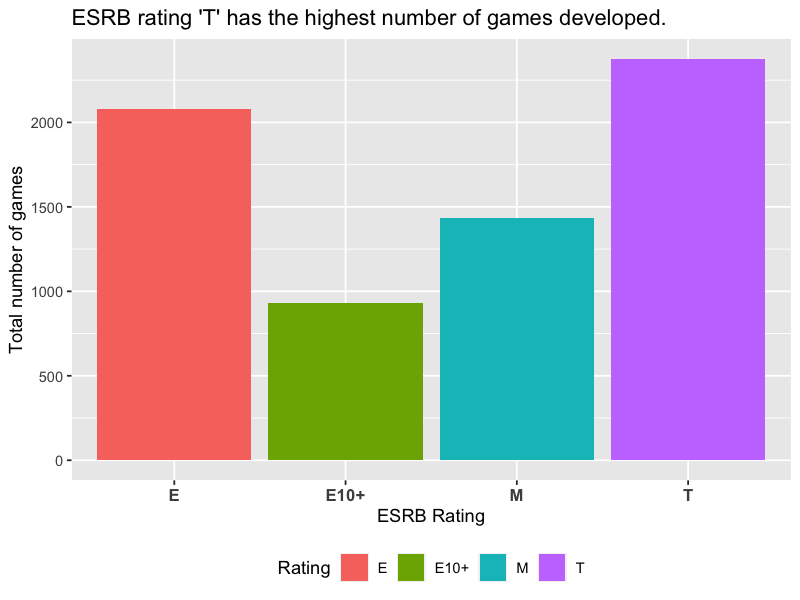
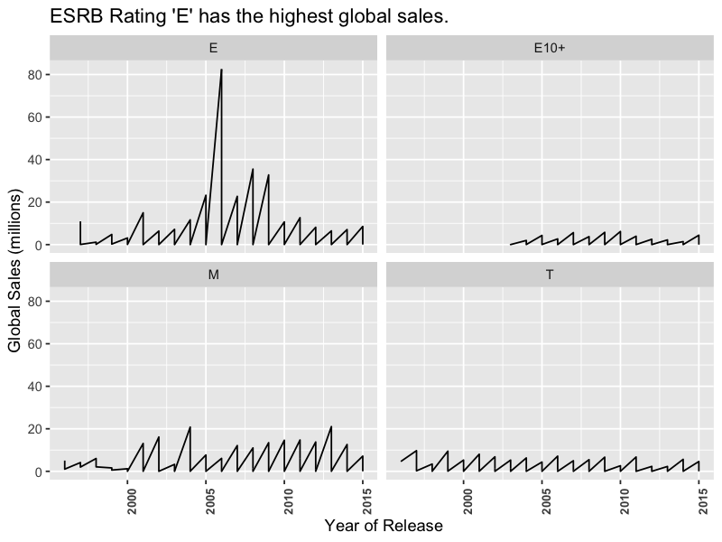

This dataset is prepared by web scraping the website ‘Metacritic’. This dataset is actually a combination of two datasets, one had the sales related information of the games and the second dataset has included gameratings by users and critics. These are the variables included:
1. Name: Title of the video game.
2. Platform: Video gaming console on which the game is released.
3. Year_of_Release: The year when the video game was released.
4. Genre: The genre of the game.
5. Publisher: The publisher who published the game.
6. Developer: The Developer who developed the game.
7. NA_Sales: Sales in North America.
8. EU_Sales: Sales in Europe.1
9. JP_Sales: Sales in Japan.
10. Other_Sales: Sales in other countries.
11. Global_Sales: Overall sales of the title.
12. Critic_Score: Aggregate score compiled by Metacritic staff.
13. Critic_Count: The number or critics used in coming with the critic score.
14. User_Score: Score by Metacritics subscribers.
15. Rating: The ESRB rating of the game.
16. User Count: Number of users who gave the user_score.

Video games have been a part of my life since early childhood, spending hours with my cousins to complete all the easter eggs hidden in the games made my day. I took this dataset to check up on the assumptions that I made as a kid about the video games industry. Some of the questions that I was looking forward to being answered by analyzing this dataset are: 

1. Have I had the bestselling console?  
2. What kind of gaming genre was the world into compared to me? 
3. What role do ESRB ratings play in game sales? 
4. Who is the bestselling video game developer? 

There are a total of 16 variables in the dataset, the most important ones for the question that I am looking to be answered are: Platform, Genre, Developer, Global Sales, and Critic Score. Since the dataset is prepared by web scrapping the website ‘Metacritic’, data preprocessing was significantly required for any kind of data analysis.  Some of the data preprocessing that I did for this dataset are: 

1. Removing all the null values. 
2. Corrected the class type of a few variables. 
3. Aligning Critic Score and User score to the same level. 
4. Checked for duplicates. 
5. Removed observations that are outliers. 

Upon analyzing the data, it was found that the PS2 was the highest-selling console and that the "Sports" genre was the most popular among gamers, as indicated by the global sales variable. I personally played “Sports” genre games the most and that too on PS2. User scores are more strict in comparison to Critic scores, as there are few games with user ratings in the range of 0 - 1 whereas there are no games with Critic scores in this range. Also, User scores have a maximum value of 9.4, and for Critic scores, the maximum value is around 9.7 - 9.8.

Furthermore, it is observed that the highest number of games developed had an ESRB rating of 'T' (teen - content suitable for ages 13 and above), suggesting that video game developers targeted teenagers as their primary audience. However, a plot of the global sales variable broken down by ESRB ratings revealed that video games with an 'E' (Everyone) rating had the highest sales over a 20-year period, while games with a 'T' rating had a low sales record. I have attached the plots of reference. 

